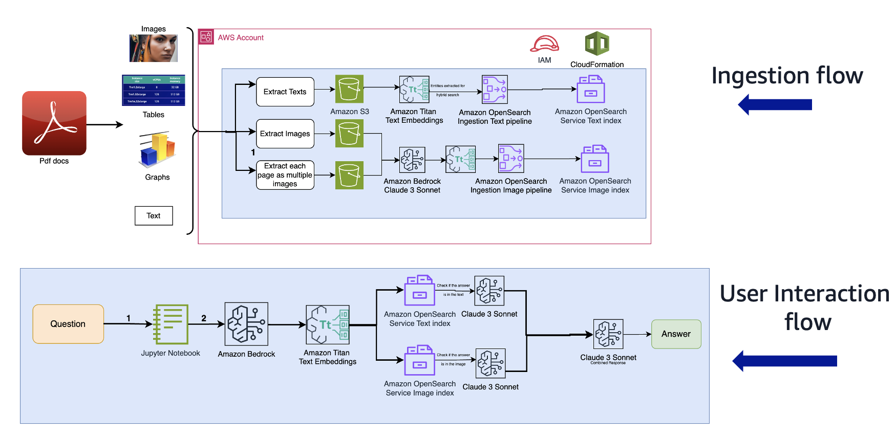

# Multimodal RAG

As illustrated from .

we did following steps each page:
### on 1_data_prep_files
1. extract image and text using `PyPDF2` library and stores each in a `.jpg` and `.txt` file.
2. store the extracted files to s3.
### on 2_data_ingestion
3. the extracted text is embeded using `Titan Text Embeding v2`. the embeddings are stored to opensearch (text index).
4. the extracted image is converted (described) to text using `Claude 3 Sonnet`, then embeded using `Titan Text Embedding v2`. the embeddings are stored to opensearch (image index).
5. use an `entities` field in the `index body metadata` to store entities from both images using `Claude 3 Sonnet` and texts using `nltk`.
### on 3_rag_inference
6. takes in a user question, then extract `entities` from that question.
7. perform `prefiltering` of the `entities` to get top-n hits from `entities matching` from both text and image index.
8. uses LLM in the loop to go over each hit and summarize all response using `Claude 3 Sonnet`.

The process of `3_rag_inference` will be converted and put on `AWS Lambda`, to get the question from Webapp API.